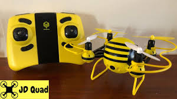

# HASAKEE FPV Drone - Reverse Engineering Project



Python implementation for controlling and receiving video streams from the HASAKEE FPV drone by reverse engineering the Android app's native libraries.

## Overview

This project provides a Python-based interface to communicate with the HASAKEE FPV drone over WiFi. The drone uses a proprietary UDP-based protocol (0x6363) for video streaming and control.

**Current Status:**
- ✅ **Video Streaming**: Fully implemented and working
- ⚠️ **Control & Status**: Not yet implemented (port 50000 appears closed on this drone model)

## Features

- Real-time MJPEG video stream reception and decoding
- Multi-packet frame assembly with proper sequencing
- VGA camera protocol (0x6363) support
- Automatic heartbeat/keepalive packets
- Frame-by-frame display using OpenCV
- Raw stream recording to file

## Requirements

```bash
pip install opencv-python numpy
```

## Quick Start

1. Connect to the drone's WiFi network (typically `HASAKEE-WiFi-XXXXX`)

2. Run the video stream receiver:
```bash
python3 stream_video.py
```

3. Video will display in a window and frames saved to `frames/` directory

## Network Configuration

The drone communicates over UDP on the following ports:

| Port | Direction | Purpose | Status |
|------|-----------|---------|--------|
| **40000** | Bidirectional | Video stream & control commands | ✅ Working |
| **50000** | Drone → App | Status data (roll, pitch, yaw, battery, GPS) | ⚠️ Closed |

**Drone IP**: `192.168.0.1` (default)

## Protocol Details

### Video Stream Protocol (0x6363)

The drone uses a proprietary packet format:

```
Offset 0x00-0x01: 0x6363 (header)
Offset 0x02:      Command type (0x01=heartbeat, 0x03=video)
Offset 0x03-0x04: Sequence ID
Offset 0x05-0x06: Packet length
Offset 0x07:      Frame type
Offset 0x08-0x0B: Frame ID
Offset 0x36 (54): JPEG data start (0xFFD8)
```

### Video Stream Initialization

1. App sends heartbeat command every 1 second:
   ```
   63 63 01 00 00 00 00
   ```

2. Drone responds with video packets (cmd_type=0x03)

3. Multiple packets assembled into complete JPEG frames

### Control Protocol (Not Yet Implemented)

Control packets follow this structure (from SANROCK U61W analysis):

```
63 63 0a 00 00 0b 00 66 [throttle] [rudder] [aileron] [elevator] 
[trim_v] [trim_r] [trim_l] [command] [mode] 99

Values: 0x00-0xFF, neutral=0x80
Commands: 0x0c=neutral, 0x1c=takeoff, 0x2c=land
Modes: 0x8c=low speed, 0x84=high speed
```

## Project Structure

```
.
├── stream_video.py              # Main video streaming application
├── control.py                   # Control packet sender (experimental)
├── decode_packet.py             # Packet structure decoder utility
├── tools/
│   └── App/
│       └── project/
│           ├── liblewei-3.2.2.so.c    # Reversed native library
│           ├── liblewei-2.3.so.c      # Older library version
│           ├── udp_processor.py       # Complete protocol implementation
│           └── README.md              # Detailed protocol documentation
└── images/
    └── drone.jpeg               # Drone photo
```

## Implementation Details

### Video Stream Manager

The `stream_video.py` implements:

- **Packet Reception**: Binds to local port and receives UDP packets
- **Header Decoding**: Parses 0x6363 protocol headers
- **Frame Assembly**: Combines multi-packet frames using sequence IDs
- **JPEG Extraction**: Extracts JPEG data from offset 54 (0x36)
- **Heartbeat**: Sends keepalive every 1 second
- **Display**: Real-time video display using OpenCV

### Key Functions

```python
decode_packet_header(data)      # Parse 0x6363 packet structure
decode_vga_obfuscation(...)     # Handle optional data obfuscation
send_command(sock, ...)         # Send UDP command to drone
decode_frame(jpeg_data, ...)    # Display JPEG frame
```

## Known Issues

1. **Port 50000 Closed**: Status data (telemetry) port appears unavailable on this drone model
   - Cannot receive roll, pitch, yaw angles
   - Cannot receive battery level
   - Cannot receive GPS coordinates

2. **Control Not Tested**: Control commands not yet verified to work
   - Port 50000 closure may indicate different control protocol
   - May require different packet structure than SANROCK U61W

3. **Frame Corruption**: Some frames may have partial corruption
   - Implemented frame blending to minimize visual artifacts
   - Previous frame data used to fill corrupted regions

## Reverse Engineering Notes

This project was created by reverse engineering the Android app's native libraries:

- **Source**: LW FPV Android app (version 1.9.2)
- **Libraries**: `liblewei-3.2.2.so`, `liblewei-2.3.so`, `liblewei63.so`
- **Tools**: Ghidra decompiler, Wireshark packet analysis
- **Protocol**: VGA camera protocol (0x6363) identified at line 15196 in decompiled code

See `tools/App/project/README.md` for complete protocol documentation.

## Future Work

- [ ] Investigate alternative status/telemetry methods
- [ ] Implement and test control commands
- [ ] Add recording to video file (MP4/AVI)
- [ ] Implement frame corruption detection and recovery
- [ ] Add GUI for control and display
- [ ] Support for HD camera protocol (lewei_cmd)

## References

- [SANROCK U61W Protocol Notes](tools/App/project/README.md#control-packet-protocol-0x6363)
- [VGA Camera Protocol](tools/App/project/README.md#vga-camera-protocol-0x6363)
- [UDP Processor Implementation](tools/App/project/udp_processor.py)

## License

This project is for educational and research purposes only. Use responsibly and in accordance with local regulations.

## Contributing

Contributions welcome! Especially:
- Testing control commands on different drone models
- Alternative methods for status/telemetry retrieval
- Frame corruption fixes
- Support for other HASAKEE/Lewei drone models

## Disclaimer

This is an unofficial reverse-engineered implementation. Not affiliated with HASAKEE or Lewei. Use at your own risk.
